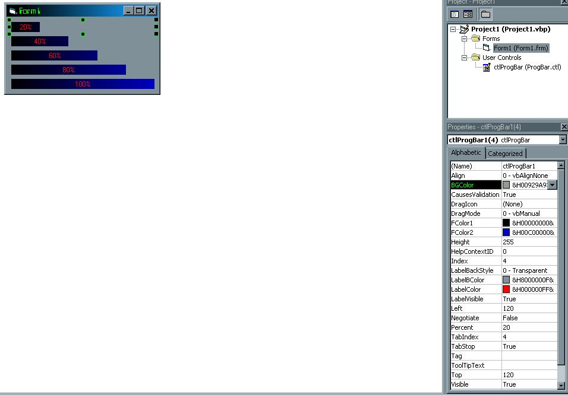



## Gradient Progress Bar With Status

### Description

this is a pretty simple thing 2 make a gradient prog bar....i used a screenshot from the project instead of the actual app because it shows most of the properies u can set...it is rly customizable...and i used it in the mod-maker for a game i am making(chk my other submisions), and the map editor(not yet done)...hope u like it
 
### More Info
 

             |
---                |---
**Submitted On**   |2001-03-18 18:57:32
**By**             |[Cory J\. Geesaman](https://github.com/Planet-Source-Code/PSCIndex/blob/master/ByAuthor/cory-j-geesaman.md)
**Level**          |Intermediate
**User Rating**    |3.5 (14 globes from 4 users)
**Compatibility**  |VB 5\.0, VB 6\.0
**Category**       |[Custom Controls/ Forms/  Menus](https://github.com/Planet-Source-Code/PSCIndex/blob/master/ByCategory/custom-controls-forms-menus__1-4.md)
**World**          |[Visual Basic](https://github.com/Planet-Source-Code/PSCIndex/blob/master/ByWorld/visual-basic.md)
**Archive File**   |[CODE\_UPLOAD172643182001\.zip](https://github.com/Planet-Source-Code/cory-j-geesaman-gradient-progress-bar-with-status__1-21760/archive/master.zip)

